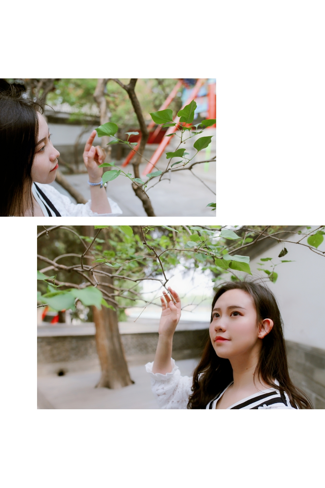
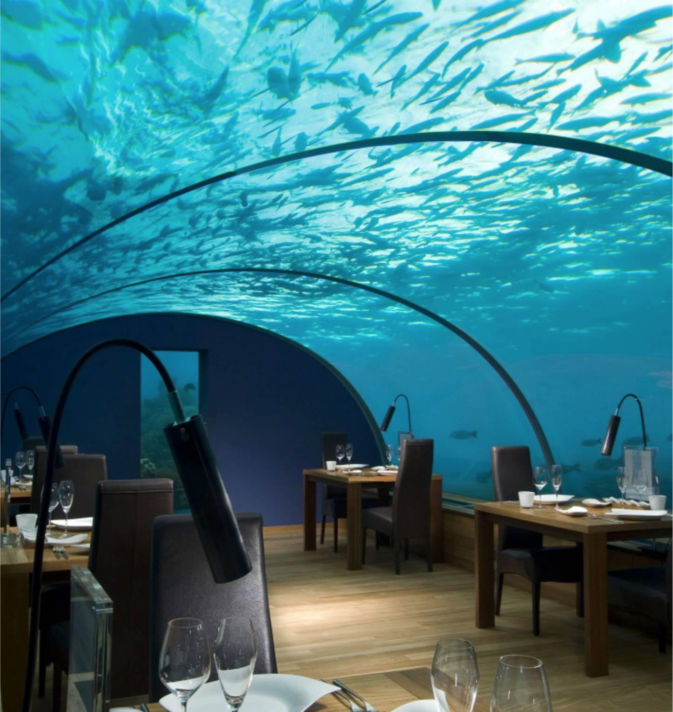

	<head>
		<meta http-equiv="Content-Type" content="text/html; charset=UTF-8" />
		<meta name="viewport" content="width=device-width, initial-scale=1, maximum-scale=1">
		<title>Taoxing Feng Personal Website</title>
		<meta name="description" content="" />
		<meta name="keywords" content="" />
		
		
		<!-- CSS -->
		<link rel="stylesheet" type="text/css" href="statics/css/index.css" media="all" />
		<link rel="stylesheet" type="text/css" href="statics/css/pictures.css" />
		<link rel="stylesheet" type="text/css" href="statics/css/audioplayer.css" />
		<link rel="stylesheet" type="text/css" href="statics/css/audioplayer2.css" media="screen">
	</head>

	<body class="home blog custom-background round-avatars">
		

		<header id="masthead" class="overlay animated from-bottom" itemprop="brand">
			

				<a href="">
					<figure>
						
					</figure>
				</a>
				<h2 class="blog-description"><b>Singing for Life</b></h2>
			

			<!-- .site-branding -->
			

				

			

			

				

					<svg id="header-decor" class="decor bottom" xmlns="http://www.w3.org/2000/svg" version="1.1" viewBox="0 0 100 100" preserveAspectRatio="none">
						<path class="large left" d="M0 0 L50 50 L0 100" fill="rgba(255,255,255, .1)"></path>
						<path class="large right" d="M100 0 L50 50 L100 100" fill="rgba(255,255,255, .1)"></path>
						<path class="medium left" d="M0 100 L50 50 L0 33.3" fill="rgba(255,255,255, .3)"></path>
						<path class="medium right" d="M100 100 L50 50 L100 33.3" fill="rgba(255,255,255, .3)"></path>
						<path class="small left" d="M0 100 L50 50 L0 66.6" fill="rgba(255,255,255, .5)"></path>
						<path class="small right" d="M100 100 L50 50 L100 66.6" fill="rgba(255,255,255, .5)"></path>
						<path d="M0 99.9 L50 49.9 L100 99.9 L0 99.9" fill="rgba(255,255,255, 1)"></path>
						<path d="M48 52 L50 49 L52 52 L48 52" fill="rgba(255,255,255, 1)"></path>
					</svg>
				

			

		</header>

		

			

				<article itemscope="itemscope">
					

						

							

								

									

										<!-- 
冯韬行
 -->
										
hi，我是冯韬行，哥伦比亚大学电子工程专业在读学生。 欢迎来到我简陋的的音乐主页（QWQ）~ 希望你可以在这里听到我的声音，感受到我想传达的心情。
										

										
Honors: 上海音乐学院 美声唱法九级（最高级）; 2015年全国艺术人才展示大赛（美声组）特金奖; 2016年北京邮电大学校园歌手大赛 冠军； 2016年CCTV希望之星英语风采大赛（歌曲赛）北京赛区一等奖; 2017年全国校园好声音（华北赛区）第三名。
										

									

								

							

						

						

							

									

										

											

												<ul>
													<li></li>
													<li></li>
													<li></li>
													<li></li>
													<li></li>
													<li></li>
													<li></li>
													<li></li>
													<li></li>
												</ul>
											

											

												
											

											

												
											

											

												<ul>
													<li jumpImg="0"></li>
													<li jumpImg="1"></li>
													<li jumpImg="2"></li>
													<li jumpImg="3"></li>
													<li jumpImg="4"></li>
													<li jumpImg="5"></li>
													<li jumpImg="6"></li>
												</ul>
											

										

									

								

							

						

						

							

								

									

										

											

												
我的歌单

											

											
共8首歌

										

									

									

										

									

								

								

									
									

										

											<h1>有你的快乐（Cover王若琳）</h1>
											
											<audio id="audio-player6" src="statics/audio/6.m4a" type="audio/mp4" controls="controls"></audio>
										

										
									

									

										

											<h1>只要平凡</h1>
											
											<audio id="audio-player2" src="statics/audio/2.m4a" type="audio/mp3" controls="controls"></audio>
										

										
									

									

										

											<h1>星语心愿</h1>
											
											<audio id="audio-player5" src="statics/audio/5.m4a" type="audio/mp4" controls="controls"></audio>
										

										
									
									

									

										

											<h1>思念（Cover蔡健雅）</h1>
											
											<audio id="audio-player4" src="statics/audio/4.m4a" type="audio/mp4" controls="controls"></audio>
										

										
									
									

									

										

											<h1>行走在茫茫月光的中间(Cover谭维维)</h1>
											
											<audio id="audio-player7" src="statics/audio/7.m4a" type="audio/mp4" controls="controls"></audio>
										

										
									

									

										

											<h1>好久不见(Cover彭佳慧)</h1>
											
											<audio id="audio-player8" src="statics/audio/8.m4a" type="audio/mp4" controls="controls"></audio>
										

										
									

									

										

											<h1>不动声色</h1>
											
											<audio id="audio-player1" src="statics/audio/1.m4a" type="audio/mp4" controls="controls"></audio>
										

										
									

									
									

										

											<h1>咖喱咖喱</h1>
											
											<audio id="audio-player3" src="statics/audio/3.m4a" type="audio/mp4" controls="controls"></audio>
										

										
									

									
								

							

						

						
						
			

		

		<footer id="footer" class="overlay animated from-top">
			

				<svg id="footer-decor" class="decor top" xmlns="http://www.w3.org/2000/svg" version="1.1" viewBox="0 0 100 100" preserveAspectRatio="none">
					<path class="large left" d="M0 0 L50 50 L0 100" fill="rgba(255,255,255, .1)"></path>
					<path class="large right" d="M100 0 L50 50 L100 100" fill="rgba(255,255,255, .1)"></path>
					<path class="medium left" d="M0 0 L50 50 L0 66.6" fill="rgba(255,255,255, .3)"></path>
					<path class="medium right" d="M100 0 L50 50 L100 66.6" fill="rgba(255,255,255, .3)"></path>
					<path class="small left" d="M0 0 L50 50 L0 33.3" fill="rgba(255,255,255, .5)"></path>
					<path class="small right" d="M100 0 L50 50 L100 33.3" fill="rgba(255,255,255, .5)"></path>
					<path d="M0 0 L50 50 L100 0 L0 0" fill="rgba(255,255,255, 1)"></path>
					<path d="M48 48 L50 51 L52 48 L48 48" fill="rgba(255,255,255, 1)"></path>
				</svg>
			

			<!-- 

				<li>
					<a title="weibo" class="socialicon" href=""><i class="iconfont" aria-hidden="true">&#xe601;</i></a>
				</li>
				<li class="wechat">
					<a class="socialicon"><i class="iconfont">&#xe609;</i></a>
					

				</li>
				<li>
					<a title="QQ" class="socialicon" href="" target="_blank"><i class="iconfont" aria-hidden="true">&#xe616;</i></a>
				</li>
			

			

				Copyright&copy;2018. Design by
				<a href="">17sucai</a>
			
 -->
			<!--  -->
			
			
			
			
			
			<!--  -->

	</body>

</html>
